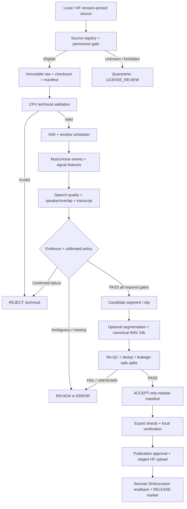

# E2E-ORNIX-DATASET — End-to-end Dataset Quality & Curation

> **Loại tài liệu:** Technical design + execution plan cho worker; **phiên bản:** 1.0-draft; **ngày:** 2026-09-24.  
> **Dự án:** Ornix Labs — Vietnamese-first multilingual TTS.  
> **Repository xuất bản dự kiến:** https://huggingface.co/datasets/Teedyyy-rm/Ornix-Datasets  
> **Trạng thái:** SPECIFICATION ONLY. Tài liệu này không xác nhận code, model, quyền dữ liệu, ngưỡng hoặc pipeline hiện đã triển khai/đạt chuẩn. Không tự thực hiện upload chỉ vì đọc được tài liệu.

## ✅ Implementation Progress (worker self-report — không tự tuyên bố APPROVED)

> Cập nhật: 2026-09-24. State machine: `NOT_STARTED → IN_PROGRESS → IMPLEMENTED → INFRA_VERIFIED → VERIFIED → AWAITING_APPROVAL → APPROVED`.
> `INFRA_VERIFIED` = plumbing/harness có test evidence nhưng **chưa** kiểm chứng trên audio thật/nhãn người. `VERIFIED` = đã kiểm chứng hành vi thật. Worker không tự đưa tới `APPROVED`. Chưa có phase nào `APPROVED`/`PUBLISHED` — đúng fail-closed.
> Evidence: `PYTHONPATH=src:tests python -m pytest` → **91 passed** (offline/CPU; real-model tests tự-skip khi chưa có weights). Real weights (Silero VAD MIT, DNSMOS ONNX) đã tải + pin sha256 + chạy inference thật: `scripts/fetch_models.py` + `tests/integration/test_real_models.py` (DNSMOS phân biệt clean/noisy; Silero nạp + chạy, cần audio giọng thật để chứng minh positive detection).

| Phase | Hạng mục | State | Module / Evidence |
|---|---|---|---|
| 0 | Source registry, rights matrix, permission gate, schema/policy draft | ✅ VERIFIED (tooling) · ⏳ AWAITING_APPROVAL (scope-freeze sign-off) | `ingestion/permissions.py`, `configs/sources.example.yaml`; T-012 |
| 1 | Local + HF read-only adapters, immutable staging, idempotent manifest, HF materialize | ✅ VERIFIED | `ingestion/`, `pipeline.ingest_and_stage`, `hf.materialize` (download→content-sha→immutable); idempotency + materialize mock tests |
| 2 | Technical WAV gate + canonical 24k mono PCM16 renderer | ✅ VERIFIED | `dsp/` (decode/resample/features/technical/render); T-008/T-009/T-010 |
| 3 | VAD, windowing, event/noise + music detectors (pluggable, fail-closed) | ✅ INFRA_VERIFIED · ⚠️ REAL_MODEL: Silero/DNSMOS tải+pin+chạy thật (test_real_models); PANNs music + pyannote overlap vẫn AWAITING (torch/gated token) | `detectors/`, `config.build_detectors`; registry + DSP-never-music + real-ONNX load/run tests |
| 4 | Quality/overlap/transcript adapters + calibration flow | ✅ INFRA_VERIFIED (runner + `calibrate` CLI + separation guard) · ⏳ AWAITING_APPROVAL (CALIBRATION_NOT_PERFORMED: cần gold-set nhãn người + ngưỡng operator ký) | `calibration/` (goldset/metrics/**runner**), `detectors/quality.py`, `detectors/speaker.py`; calibration runner + leakage tests |
| 5 | Deterministic policy engine, review, segmentation (snap-to-silence), LSH dedup, leakage-safe split | ✅ VERIFIED | `curation/`; T-001..T-007, T-011, segmentation snap+uncertain, LSH-scale dedup, determinism + split-leakage tests |
| 6 | Release build (Parquet/WebDataset), rights-safe gating, dataset card, offline verify | ✅ VERIFIED | `exporters/`, `ReleaseRow.validate(release_target)` (TRAIN_ONLY≠public); T-015 + rights-gate tests |
| 7 | HF staged publisher: dry-run default, approval gate (digest+revision bound), exact-set remote verify | ✅ VERIFIED (dry-run + gate logic) · ⏳ AWAITING_APPROVAL (real upload needs operator receipt + token) | `publishing/`; T-013/T-014 blocked-without-approval/token, revision-bind + exact-set remote_verify tests |
| 8 | Cache, checkpoint, worker queue, retention/takedown, runbook | ✅ VERIFIED | `ops/`, `README.md`; cache-invalidation/checkpoint-idempotent/takedown tests |

**Test matrix coverage (T-001..T-016):** T-001/T-002/T-004/T-005/T-006/T-007/T-012 `tests/unit/test_policy.py`; T-003/T-011 + segmentation-snap + LSH-dedup `tests/unit/test_curation.py`; T-008/T-009/T-010 `tests/unit/test_technical.py`; rights-safe release `tests/unit/test_release_rights.py`; HF materialize `tests/unit/test_hf_materialize.py`; publishing hardening (exact-set + revision-bind) `tests/unit/test_publishing.py`; real ONNX weights `tests/integration/test_real_models.py`; calibration runner `tests/integration/test_calibration_runner.py`; T-013/T-014/T-015/T-016 `tests/acceptance/`. **Explicitly NOT auto-claimed:** PANNs music + pyannote overlap real detection (need torch/gated token); publishable calibration thresholds (need human-labeled audio, operator-signed — CALIBRATION_NOT_PERFORMED); real partial-upload/resume + cross-platform bitwise reproducibility (need live HF remote).


## 0. Đọc trước khi triển khai: mục tiêu và giới hạn

**Mục tiêu cuối:** tạo một *bộ công cụ lựa chọn dữ liệu giọng nói sạch*, nhập file từ nhiều nguồn, xác định nhiễu và lỗi chất lượng, chỉ giữ các đoạn/file đáp ứng chính sách để train Ornix lâu dài, chuẩn hóa output 24 kHz mono PCM16 WAV, tạo metadata và các shard phù hợp streaming; chỉ **phát hành các bản ghi được cấp quyền phân phối** lên Hugging Face (HF). Dữ liệu bị nhiễu mạnh phải **bỏ qua khỏi release**, không có nghĩa là xóa nguồn. Dữ liệu `REVIEW`, `ERROR`, `UNKNOWN` không được tự động upload vào tập sạch.

Các loại lỗi ưu tiên: **nhạc nền đồng thời với lời nói; tiếng xì/rè/static/hum/buzz; tiếng quạt/xe/máy/gió; tiếng người khác nói chồng; clipping/vỡ tiếng; méo do codec hoặc khử nhiễu; tiếng vang nặng; file không có lời nói; transcript không khớp**. Công cụ nhằm *tuyển chọn*, **không** mặc định biến audio nhiễu thành audio sạch bằng denoise. Giữ nguyên nội dung phát âm, âm cuối và thanh điệu tiếng Việt; không đánh đồng “sạch” với “đọc đều, ít cảm xúc”.

**Định nghĩa hoàn thành:** không phải `script chạy được`, mà là có hợp đồng dữ liệu, phép đo được kiểm chứng trên ground truth, audit từng file, hồi phục sau lỗi, release tái lập được và upload có kiểm chứng. Các số đo/điểm model chỉ là *evidence*, không phải chứng minh tuyệt đối rằng file “không có nhiễu”.

### 0.1 Các quyết định đã chốt so với quyết định còn mở

| Chủ đề | Quyết định thiết kế | Điều phải kiểm chứng/chốt trước vận hành |
|---|---|---|
| Audio output | WAV, 24,000 Hz, mono, signed PCM16; lưu thông số và SHA-256 nguồn | Bản gốc 8/16 kHz upsample thành 24 kHz không phục hồi băng thông đã mất; chính sách nguồn âm thanh nào được chấp nhận phải được phê duyệt |
| Thời lượng | `duration_s <= 12.0` cho mỗi clip *cuối cùng* | `min_duration_s`, padding VAD, ngưỡng speech ratio và dung sai đo cần hiệu chỉnh/chốt; không tự đặt một con số rồi công bố chuẩn |
| Nhiễu | Multi-label + timestamp + severity + nguồn bằng chứng | Chọn ngưỡng từng loại từ tập nghe gán nhãn, không mặc định SNR > 20 dB hay DNSMOS > 4 là PASS |
| Chất lượng | `ACCEPT`, `REVIEW`, `REJECT`, `ERROR`, `LICENSE_REVIEW` | Chỉ `ACCEPT` sau tất cả hard gates và quyền phân phối; `ERROR` không phải `REJECT` do nhiễu |
| Thu thập | Local + nguồn HF/dữ liệu được cấp quyền, có manifest, provenance | Chưa có danh sách nguồn nào được auto-authorize; không giả định dataset “public” cho phép tái phân phối |
| Phát hành | Chỉ accepted + đúng giấy phép lên `Teedyyy-rm/Ornix-Datasets` | Token ghi, scope, release ID và quyết định publish thực tế cần operator phê duyệt; mặc định dry-run |
| Mô hình QC | Các lựa chọn ở §4 là **candidate** | Xác nhận chính xác checkpoint, revision, checksum, license *weights* và benchmark trước khi thành required gate |

### 0.2 Invariants bắt buộc (fail-closed)

1. `source_bytes` bất biến; mọi phép sửa/cắt/chuẩn hóa sinh artifact mới, tham chiếu `source_sha256`, `parent_segment_id`, processing recipe.
2. `ACCEPT` chỉ khi **mọi required gate** trả PASS và bản ghi có `redistribution_permitted=true` nếu dành cho public release. Thiếu metric / checkpoint / quyền / transcript bắt buộc => không tự PASS.
3. Không normalize âm lượng/khử nhiễu hoặc overwrite mẫu gốc một cách ngầm; không tự thay transcript bằng ASR hoặc suy đoán speaker ID.
4. Quyết định phân loại **ở mức segment và file**; file nguồn bị nhiễu 2 giây có thể chứa đoạn sạch cứu được, nhưng *đoạn sau cắt phải được kiểm tra lại đầy đủ*. Không cắt ngang âm tiết/chuyển tiếp và không giữ transcript cũ nếu cắt mất từ.
5. Checksum của audio output kiểm tra lại trên file thực; metadata và audio không được lệch hàng khi shuffle/shard. Đã chia train/val/test thì không để bản trùng/gần trùng hoặc cùng speaker lọt sang tập đánh giá dành cho unseen speaker.
6. Không được upload `raw/`, `rejected/`, `review/`, `quarantine/`, token, private logs, PII hoặc file chưa rõ quyền. Gated HF **không** tự cấp quyền tái phân phối.
7. Dừng ở blocker thay vì fake PASS, default sạch hoặc tiếp tục phase/publish khi chưa có phê duyệt. Không được tuyên bố `PUBLISHED` chỉ vì lệnh upload trả success.
8. Mọi hard-gate threshold, code, model/weight revision, config, environment, source revision và reviewer decision có provenance; không có kết quả phụ thuộc vào nhãn ngẫu nhiên không lưu seed.
9. Tài liệu không cấp quyền tự push GitHub hoặc HF; thao tác mạng có khả năng thay đổi tài nguyên cần có scope và phê duyệt operator riêng.

## 1. Phạm vi chức năng và đối tượng sử dụng

### 1.1 In-scope

- Quản lý nguồn và quyền: nguồn dữ liệu, điều khoản, speaker consent nếu cần, mục đích sử dụng, quyền tạo bản chuyển đổi, quyền công khai/tái phân phối, attribution, thời hạn/chính sách gỡ bỏ.
- Ingest nội bộ: quét local WAV/FLAC/MP3 và đọc HF dataset **có revision pin**, nhập transcript/speaker/source metadata; có chế độ dry-run, offline test và batch incremental.
- Technical QA: kiểm tra decode, duration, sample rate thực tế, channels, PCM range, NaN/Inf, silence, RMS/peak, clipping, DC offset, discontinuity, nguồn mất mát (nếu biết), loại file hỏng.
- Content QA: speech/non-speech, music overlap, noise-event labels/timestamps, ước lượng noise floor/SNR nếu có thể, metric chất lượng giọng, overlapping speakers, transcript alignment/check, dedup.
- Curation: chọn, cách ly, segment có điều kiện, re-QC, convert WAV canonical, split train/validation/test an toàn, metadata/manifest, export Parquet/WebDataset, xác minh streaming.
- Xuất bản HF dưới cơ chế operator approval + verification + rollback plan (không sửa release cũ).

### 1.2 Out-of-scope v1

- Tự thu thập/scrape tài liệu trái điều khoản; tự động cấp quyền hoặc thay đổi giấy phép audio bằng cách đổi tên nguồn.
- Tự động denoise tất cả nguồn, tự sinh transcript chính thức bằng ASR, tự nhận diện danh tính người thật hoặc khẳng định đồng ý voice cloning từ việc tệp được public.
- Training TTS, training detector mới từ đầu, tự động deploy production, tự push remote khi hoàn thành phase.
- Khẳng định SNR thật nếu chỉ có tín hiệu mixture và không có clean/noise reference hoặc noise-only region đủ hợp lệ.

## 2. Hệ thống E2E, ranh giới và data flow



**Process boundaries:** ingestion, signal analysis, ML detector, deterministic policy engine, review, exporter, publisher là các module riêng; policy engine không trực tiếp gọi HF; publisher **không** tái chấm chất lượng; training đọc **release manifest đã khóa**, không tự đổi nội dung dữ liệu.

### 2.1 Contracts giữa các module

| Giao diện | Input tối thiểu | Output tối thiểu | Lỗi phải được thể hiện |
|---|---|---|---|
| `SourceAdapter.scan()` | URI/path, source revision, auth read-only | `SourceRecord[]` có checksum/bytes, rights status | Network/auth/unknown license -> `ERROR` / `LICENSE_REVIEW` |
| `TechnicalValidator.run()` | source bytes, declared metadata | measured audio properties + reason codes | corrupt/NaN/Inf/missing -> `REJECT_TECH` |
| `VadAdapter.infer()` | resampled analysis audio, model checksum | intervals ở tọa độ nguồn + confidence | no checkpoint/inference failure -> `ERROR` |
| `NoiseDetector.infer()` | analysis windows + speech masks | multi-label, intervals, scores + model provenance | unavailable model -> `UNKNOWN`, không âm thầm `NO_NOISE` |
| `QualityAdapter.infer()` | speech region, model metadata | SIG/BAK/OVRL nếu model hỗ trợ | thiếu model hoặc ngoài domain -> `UNKNOWN` |
| `PolicyEngine.decide()` | tất cả evidence + policy revision | trạng thái, danh sách reason, required/observed checks | thiếu required field => `REVIEW` / `ERROR` |
| `CurationEngine.render()` | approved intervals, transcript verified | canonical clip, content hash, process lineage | clip invalid hoặc transcript mismatch -> NOT_ACCEPTED |
| `Exporter.build()` | locked accepted manifest | shards + checksums + dataset card + index | missing/extra rows => fail |
| `Publisher.publish()` | approved release dir + explicit operator receipt | remote commit SHA + verified release report | partial upload/403/429/mismatch => not published |

## 3. Taxonomy: phát hiện *loại* nhiễu và *mức ảnh hưởng*

**Phân loại đa nhãn** (nhiều loại cùng tồn tại), thêm `start_s/end_s`, `overlaps_speech`, `severity`, `confidence`, `detector`, `model_revision` và evidence. Đây là taxonomy do Ornix định nghĩa dựa trên các khái niệm sound-event, **không** phải nhãn ground truth chỉ vì model dự đoán.

| Nhãn | Hiện tượng và ranh giới | Điều kiện xử lý sơ bộ |
|---|---|---|
| `MUSIC_BACKGROUND` | Nhạc dưới/đồng thời với voice, kể cả nhạc nhỏ | vùng đồng thời lời nói -> REVIEW/REJECT theo policy được hiệu chỉnh; không chỉ dựa SNR |
| `MUSIC_ONLY` | Intro/outro/music-only không speech | loại vùng đó, xem khả năng cứu đoạn speech khác |
| `HISS_STATIC` | tiếng xì, rè điện tử/băng từ | đo vùng im lặng + speech; mức mạnh ảnh hưởng lời nói -> REJECT |
| `HUM_BUZZ` | ù điện/họa âm, vo ve | spectral feature là bằng chứng phụ, không tự quyết định sạch |
| `TRANSIENT_CRACKLE` | lách tách, pop, click | đo phân đoạn, tránh nhầm phụ âm bật hơi |
| `ENV_CONTINUOUS` | quạt, điều hòa, mưa, động cơ | ước lượng tương quan speech/noise, quality effect |
| `ENV_TRANSIENT` | còi xe, gõ cửa, chó sủa | định vị vùng nhiễu để cắt hợp lệ nếu có thể |
| `WIND_MIC` | gió tác động micro, rumble | đo/phát hiện, không tự high-pass nguồn xuất bản |
| `INTERFERING_SPEECH` | speaker khác, kể cả nói ở nền | single-speaker target: không chấp nhận overlap xác nhận |
| `REVERB_ECHO` | vọng phòng, tiếng lặp | đánh giá riêng, noise score cao không đủ xác nhận chất lượng |
| `CLIPPING_DISTORTION` | bão hòa/overload/vỡ tiếng | đo trước khi normalize, phân biệt near-peak tự nhiên |
| `CODEC_PROCESSING_ARTIFACT` | méo do nén/denoise, tiếng kim loại | reviewer hoặc model speech quality có căn cứ |
| `NO_SPEECH`, `TRUNCATED`, `TRANSCRIPT_MISMATCH` | không chứa giọng; cắt mất âm; sai văn bản | gate độc lập, không phải chỉ số noise |
| `UNKNOWN_EVENT` | chưa nhận diện/ngoài domain | giữ `UNKNOWN`, không được chuyển thành clean |

**Severity theo tác động**, không dùng số đo tổng hợp mơ hồ:

- `N0`: chưa phát hiện nhiễu đáng kể bằng các detector đã hiệu chỉnh trên đúng domain; **không đồng nghĩa noise-free tuyệt đối**.
- `N1`: nhiễu nhỏ, không che lời trong đánh giá tham chiếu; có thể xem xét giữ theo policy cụ thể cho từng nhãn.
- `N2`: nhiễu nghe rõ/ảnh hưởng một số vùng; REVIEW hoặc chỉ giữ đoạn tái kiểm tra PASS.
- `N3`: nhiễu/nhạc/chồng giọng lấn át, clipping hoặc artifact nặng được xác nhận; loại vùng khỏi target sạch.
- `NX`: không có đủ bằng chứng; REVIEW/ERROR; không tạo threshold ngẫu nhiên.

Chỉ công bố ngưỡng sau calibration. Music detector trả điểm *không phải* tỷ lệ âm lượng nhạc; DNSMOS BAK *không phải* độ tin cậy nhạc nền; VAD *không phải* music detector; SNR ước lượng không loại trừ có người nói khác. Kiểm tra trên từng cửa sổ (ví dụ 1–3 giây **chỉ là tham số thí nghiệm**) với overlap; sau đó union/dilate interval có kiểm soát để tránh bỏ sót sự kiện ngắn. Nếu một đoạn 12 giây chỉ có 0,5 giây nhạc, không được dùng average toàn file để che lỗi.

## 4. Technology stack đề xuất, điều kiện chọn model

| Vai trò | Candidate/tool | Input/điểm lưu ý | Required hay optional |
|---|---|---|---|
| Decode/probe | FFmpeg/ffprobe, soundfile/libsndfile | Kiểm tra thông số thực; quản lý phiên bản FFmpeg, giới hạn bộ nhớ & duration | REQUIRED |
| DSP | NumPy, SciPy, librosa khi thật sự cần | RMS, peak, DC, STFT, clipped runs, ước lượng noise floor; bằng chứng giới hạn | REQUIRED phần cơ bản |
| VAD | Silero VAD (ONNX hoặc PyTorch) | Hỗ trợ 8/16 kHz: resample **bản analysis riêng** về 16 kHz; timestamp quy đổi đúng sang nguồn/24 kHz | Candidate REQUIRED sau benchmark |
| Sound event | PANNs hoặc detector cùng mục tiêu | Tagging lớp speech/music/noise; nếu model chỉ trả tag toàn file thì thêm windowing, không giả time interval | Candidate REQUIRED cho music gate |
| Phân loại bổ trợ | CLAP hoặc mô hình âm thanh được kiểm chứng | Similarity không phải posterior xác suất; benchmark trên tiếng Việt, không auto-approve | OPTIONAL |
| Quality | DNSMOS P.835 hoặc NR-SQA thay thế | SIG/BAK/OVRL, model sample rate & duration requirement; **xác minh license code + weights riêng** | Candidate REQUIRED khi được cấp quyền |
| Speaker/overlap | pyannote.audio hoặc thay thế | Diarization không xác định danh tính thật; có pipeline/models cần access terms riêng | Optional -> required nếu policy single-speaker |
| Transcript QA | ASR assist + tokenizer/aligner phù hợp tiếng Việt | Dùng để flag; manual verify hoặc evidence đủ mạnh trước ACCEPT | REQUIRED transcript gate; model cụ thể TBD |
| Metadata/shards | PyArrow, Hugging Face Datasets, Parquet; WebDataset nếu phù hợp | Parquet nhúng byte audio + feature schema; benchmark size/streaming | REQUIRED exporter |
| HF publish | `huggingface_hub` + `hf_xet` | Auth scoped token, upload_folder, kiểm tra remote tree/commit; không ghi đè release cũ | REQUIRED ở phase publish |
| Validation/tests | pytest, fixtures WAV synthetic, human-labeled calibration set | Positive/negative/edge/network-fault/incremental tests | REQUIRED |

**Giấy phép:** xác minh từng thành phần **source code, model weights, training corpus, bộ dữ liệu đầu vào** và quyền thương mại/phân phối của mỗi nguồn. Chẳng hạn, NISQA repo ghi code MIT nhưng pretrained weights CC BY-NC-SA 4.0: không được mặc định dùng weights đó cho nghiệp vụ thương mại. Không đưa model chỉ vì repo công khai. DNSMOS là mô hình no-reference đánh giá chất lượng, không làm chứng rằng file hoàn toàn không có nhạc. Một checkpoint chưa tải được/không rõ license phải để adapter `UNAVAILABLE` và block required gate, không tải trọng số khác rồi tự thay thế.

**Kết quả research không biến thành implementation:** worker cần đọc API & version chính xác trước khi khóa dependency. Đặc biệt HF Datasets các phiên bản mới trả AudioDecoder thay vì luôn là `audio["array"]`; phải có decoder adapter và test với phiên bản pin.

## 5. Chất lượng và ground truth: chính sách bắt buộc trước khi auto-filter

### 5.1 Calibration corpus

Tạo *gold set* đa nguồn với file tự nhiên và synthetic mixture được cấp phép: clean studio, hiss/static/hum, nhạc speech-overlap nhiều mức, noise môi trường liên tục/đột ngột, clipping, codec artifacts, reverb, multiple speakers, tiếng Việt Bắc/Trung/Nam, nam/nữ và biểu cảm. Tách theo **nguồn + speaker + family recording** giữa calibration và held-out evaluation (không để cùng bản gốc/biến thể nhiễu vào cả hai). Mỗi clip được nghe bởi người đánh giá, lưu loại sự kiện, interval và mức ảnh hưởng. Nếu hai người bất đồng, có adjudication + log.

### 5.2 Metrics bắt buộc

- Per class `MUSIC_BACKGROUND`, `HISS_STATIC`, `CLIPPING_DISTORTION`, `INTERFERING_SPEECH`: precision, recall, F1, confusion matrix, đánh giá interval/segment nếu detector time-based.
- **False accept rate** = số clip nhiễu *theo ground truth* nhưng được `ACCEPT` / tổng clip nhiễu trong evaluation; tách theo lớp và source. **False reject rate** = clip sạch bị REJECT / tổng clip sạch; báo cáo `REVIEW/UNKNOWN` riêng, không ẩn khỏi denominator khi lập biểu đồ funnel.
- Coverage = số clip đã đi qua toàn bộ required gates / số clip eligible đã ingest; tỷ lệ error, review, recoverable segments, clean hours retained, retained speakers/linguistic coverage.
- Mục tiêu định lượng acceptance (*chẳng hạn giới hạn false accept tối đa*) do operator chốt sau đo baseline. **Không bịa số % hoặc tuyên bố zero noise**.
- Holdout audio có nhạc nhỏ dưới speech và nhiễu chỉ xuất hiện trong lúc phát âm là case bắt buộc. Benchmark theo per-source; kết quả tốt ở studio không chứng minh tổng quát cho podcast/điện thoại.

### 5.3 Rule engine và quyết định cuối

Mỗi policy khai báo `required_checks[]`, ngưỡng đã hiệu chỉnh và model versions; threshold chỉ thay đổi qua version mới. Hard reject cho technical corruption/no speech/speech overlap hoặc music overlap được xác nhận theo chính sách. `REVIEW` khi metrics mâu thuẫn, thiếu chứng cứ, không đủ đoạn noise-only để ước lượng SNR, output ngoài calibration domain. `ERROR` cho lỗi hệ thống. Quyết định của reviewer phải lưu reviewer-id nội bộ, timestamp, reason, evidence; không chỉnh sửa raw metric. Không dùng ML confidence để thay thế giấy phép.

## 6. Data contracts & ví dụ schema

### 6.1 Source manifest (append-only)

Một dòng/file gốc, tối thiểu: `source_id`, `source_uri`, `source_revision`, `original_file_id`, `source_sha256`, `source_mime/codec`, `source_sample_rate`, `source_channels`, `source_duration_s`, `source_license`, `license_evidence_uri`, `rights_owner/consent_reference` (nếu áp dụng), `redistribution_permitted`, `commercial_training_permitted` hoặc `UNKNOWN`, `attribution_required`, `ingestion_timestamp_utc`, `source_split`, `source_speaker_ref`, `source_transcript`, `ingest_status`. Không đăng công khai consent documents hoặc thông tin người nói không cần thiết.

### 6.2 Quality evidence (không ghi đè kết quả cũ)

Một dòng/clip candidate: `segment_id`, `source_sha256`, `interval_start_sample`, `interval_end_sample`, `analysis_sample_rate`, `vad_intervals`, `noise_events[]` (label, start/end, overlap speech, score, model_id/revision), `estimated_snr_db` + `snr_method/status`, `clipping_ratio`, `max_clipped_run`, `speech_ratio`, `SIG/BAK/OVRL` + metric model id, `speaker_overlap_intervals`, `transcript_match_status`, `calibration_domain`, `required_checks[]`, `decision`, `reason_codes[]`, `policy_version`, `processing_sha256`, `analyzer_version`, `timestamp_utc`.

### 6.3 Release row (chỉ ACCEPT)

```json
{
  "audio_id": "ornix_vi_00000001",
  "audio": "audio/orni...00000001.wav",
  "language": "vi",
  "speaker_id": "anon_speaker_0001",
  "transcript": "Xin chào, tôi là Ornix.",
  "sample_rate": 24000,
  "channels": 1,
  "encoding": "PCM_S16LE",
  "duration_s": 2.15,
  "source_id": "SRC_APPROVED_001",
  "source_sha256": "<64-hex-source-sha256>",
  "audio_sha256": "<64-hex-rendered-audio-sha256>",
  "segment_start_sample_source": 12345,
  "segment_end_sample_source": 115545,
  "rights_record_id": "RIGHTS_001",
  "quality_evidence_id": "EVID_001",
  "quality_policy_version": "ornix-qc-v1",
  "quality_gate": "ACCEPT",
  "split": "train",
  "release_id": "ornix-dataset-v001"
}
```

**Chú ý:** ví dụ minh họa, các SHA và tên file chưa phải dữ liệu thực. Release phải có audio bytes hoặc đường dẫn nội bộ *nằm trong shard/repo*, không tham chiếu path máy build. Schema có version, strict types, nullable fields phân biệt `NOT_APPLICABLE`, `UNKNOWN`, `ERROR`, không ghi `false/0` khi phép đo chưa chạy.

### 6.4 Naming, provenance, split

- ID được tạo ổn định từ source identity + source hash + vị trí segment + recipe version; không phụ thuộc thứ tự quét hoặc tên nguồn (tên phát hành `ornix_...` là presentation alias và luôn có mapping chính xác).
- Không đổi metadata gốc thành “tự tạo từ Ornix”: giữ `source_id`, attribution, quyền và lịch sử chuyển đổi; `Ornix` là tên bản phát hành chuẩn hóa, không xóa xuất xứ.
- Dedup exact bằng SHA nguồn/output; near-duplicate bằng fingerprint/embedding + verification; train/val/test split theo source-group, recording-family và speaker theo mục tiêu đánh giá; thống kê số mẫu/speaker sau split. Shuffle shard bằng seed đã lưu, đảm bảo join qua `audio_id` bất biến.

## 7. CLI và cấu trúc source đề xuất (worker điều chỉnh sau audit repo)

```text
ornix-dataset-curation/
├── E2E-ORNIX-DATASET.md
├── pyproject.toml
├── configs/
│   ├── sources.example.yaml
│   ├── audio_profile.yaml
│   ├── quality_policy.example.yaml
│   └── models.lock.example.yaml
├── src/ornix_dataset/
│   ├── cli.py
│   ├── contracts/{source,quality,release}.py
│   ├── ingestion/{local,hf,permissions}.py
│   ├── dsp/{decode,technical,resample,features}.py
│   ├── detectors/{vad,music_noise,quality,speaker}.py
│   ├── curation/{policy,segmentation,transcript,dedup,split}.py
│   ├── exporters/{parquet,webdataset,manifest}.py
│   ├── publishing/{hf,verification}.py
│   └── audit/{events,reports}.py
├── tests/{unit,integration,acceptance,fixtures}/
└── work/    # .gitignore: raw, tokens, cache, evidence private, releases
```

Đây là **cấu trúc mục tiêu**, không chỉ thị tạo mọi thư mục/module ngay giai đoạn 1. Kiểm tra repo hiện có và reuse component đúng contract; tránh tạo duplicate code/README/YAML/entrypoint rác.

**Giao diện CLI tối thiểu** (tên có thể đổi sau audit nhưng semantics phải giữ):

```text
ornix-dataset sources validate --config ... --dry-run
ornix-dataset ingest --config ... --run-id ...
ornix-dataset qc --manifest ... --policy ... --models-lock ...
ornix-dataset review export --run-id ...
ornix-dataset curate --run-id ... --accepted-only
ornix-dataset release build --run-id ... --release-id ...
ornix-dataset release verify --release-dir ... --offline
ornix-dataset publish --release-dir ... --repo-id ... --dry-run
ornix-dataset publish --release-dir ... --repo-id ... --approval-file ...
ornix-dataset publish verify --repo-id ... --commit-sha ...
```

`publish` dry-run mặc định. Lệnh publish thực cần `--approval-file` ràng buộc digest của release, repo đích, quyền ghi, policy, bản quyền, hạn mức bytes và ngày/định danh operator; quá hạn/mismatch => STOP. Cấm tìm token trong log; nhận qua `HF_TOKEN`/secret manager.

## 8. Workflow build/checkpoint dài hạn

- Lưu run manifest trên từng input batch; trạng thái `DISCOVERED -> RIGHTS_VERIFIED -> INGESTED -> TECH_VERIFIED -> ANALYZED -> REVIEWED/ACCEPTED/REJECTED -> PACKAGED -> RELEASE_VERIFIED -> PUBLISHED_VERIFIED`.
- `REVIEW`, `ERROR`, `LICENSE_REVIEW` là trạng thái riêng; không auto retry vô hạn. Retry giới hạn với backoff cho lỗi mạng tạm thời; 401/403 hoặc rights unknown phải STOP; 429 tôn trọng retry-after/rate-limit. Mỗi file idempotent theo content hash + config/model revisions.
- Persist completed records trước checkpoint progress; atomic write + fsync hoặc transactional store; crash recovery không double-insert, không mất evidence. Log metrics bytes/s, clips/s, CPU/GPU wall time, peak RAM, cache-hit, accepted-hour yield, cost/accepted-hour, error distribution. GPU chỉ chạy trên file đã pass CPU/rights.
- Không train trên phiên bản `main` mutable; tiêu thụ release theo commit SHA/release manifest digest; nếu streaming cần pin revision + measure cache/prefetch và verify rằng downloader không bỏ qua file lỗi.

## 9. Kế hoạch triển khai theo phase — mỗi phase là nhiệm vụ worker độc lập

> **Execution rule:** Worker phải đọc `E2E-ORNIX-DATASET.md`, kiểm tra hiện trạng repo trước khi sửa, lập evidence checklist, thực thi đúng **một phase được giao**, chạy tests tương ứng, báo cáo blockers, cập nhật progress khi có bằng chứng. **Không tự mở phase tiếp theo hoặc publish.** Các lệnh nặng/GPU, ghi remote hoặc thay đổi source/licensing cần phê duyệt riêng. Không tạo branch Git của Ornix Labs trừ khi operator đổi quyết định; staging branch HF nếu cần để upload là chuyện riêng, không mặc định được phê duyệt.

### Phase 0 — Audit baseline, quyền dữ liệu và scope freeze

**Phụ thuộc:** Không. **Goal:** xác định repository thực tế, reuse hay xây tool tách biệt, file/schema hiện có, input sources, quyền/cấu hình HF và giới hạn vận hành.

**Build/Review:** kiểm tra cấu trúc và thư mục, dependencies, dataset manifests, README/license, quy trình dữ liệu và HF schema hiện có; lập source registry; phân loại mỗi source `REDISTRIBUTION_APPROVED`, `TRAIN_ONLY`, `LICENSE_REVIEW`, `FORBIDDEN`. Xác định transcript/speaker availability; đề xuất acceptance criteria và ngân sách pilot. **Không download hàng loạt hoặc upload.**

**Deliverables:** baseline report (HEAD/version, existing components, gaps, conflicts, dependency graph), source/rights matrix, initial schema/policy draft, security and privacy checklist.

**Tests:** negative fixture `public repo nhưng redistribution denied`; thiếu license/consent; source revision thay đổi; không truy cập được source. **Acceptance:** tất cả nguồn chưa được xác thực không thể lọt qua publish gate; danh sách blocker minh bạch. **STOP:** thiếu repo/scope, không rõ rights, yêu cầu phá vỡ dữ liệu cũ.

### Phase 1 — Ingestion + immutable source provenance

**Phụ thuộc:** Phase 0 approved. **Goal:** nhập dữ liệu đa nguồn mà không mất nguồn gốc.

**Build/Review:** local adapter, HF read-only adapter pin source commit SHA, parser metadata có schema version, hash+collision handling, local immutable staging, retry/backoff/cursor, đơn vị đo nguồn và duration. Không tự scrape website. Cách ly file thiếu transcript/rights theo policy; không mất row khi worker chết.

**Deliverables:** scanner/manifest, sample fixture, CLI ingest, reports count/hash per source. **Tests:** input 0 file, duplicate file/alias name, malformed metadata, network drop/resume, 401/403/429, checksum change, source SHA pin; second run yields same source IDs, no duplicated record. **Acceptance:** 100% file eligible được liệt kê hoặc ghi lỗi riêng, source bytes không bị mutate, repeat run idempotent. **STOP:** nguồn bản quyền chưa được làm rõ.

### Phase 2 — Technical WAV gate & canonical audio renderer

**Phụ thuộc:** 1. **Goal:** loại file kỹ thuật hỏng, tạo audio output 24 kHz đúng cách.

**Build/Review:** ffprobe/soundfile decoder, duration/sample rate/channels thực, NaN/Inf/no-speech-level, RMS/peak, DC/clipped-run/discontinuity diagnostics. Resample polyphase/band-limited, mono downmix có chính sách (kiểm tra phase cancellation) và 16-bit conversion có clipping guard; giữ raw, hash output, đo lại sample rate/duration. Chỉ render khi có đoạn ứng viên được xác thực; với duration >12s, có thể chuyển sang segmentation thay vì tự reject toàn bộ nguồn dài.

**Deliverables:** technical evidence, renderer recipe, codec provenance, CPU fixtures. **Tests:** 8k/16k/24k/44.1k/48k WAV, MP3 disguised as WAV, stereo anti-phase, empty, corrupt, clipped input, NaN, quá ngắn/dài, boundary 12s, resampling không chỉ sửa header; sample-count vs duration tolerance. **Acceptance:** output thực 24k mono PCM16, không lỗi kỹ thuật được silent PASS. **STOP:** resampler phá âm, mất source provenance.

### Phase 3 — VAD, windowing và event/noise detector

**Phụ thuộc:** 2 + weights/license review. **Goal:** phát hiện có giọng nói ở đâu và nhiễu nào xuất hiện khi nói.

**Build/Review:** adapter VAD 16k analysis view; mapping timestamps qua nguồn 24k chính xác; chunk/window scheduler có overlap; candidate PANNs/music detector và DSP noise diagnostics; multi-label intervals, confidence và raw scores; unit tests bằng speech + music/noise mixtures; không dùng file-level tag giả làm timestamp.

**Deliverables:** detector model lock, latency/throughput report, evidence intervals, visualization/debug review (nếu cần). **Tests:** speech-only, music-only, speech+music concurrent ở nhiều mức, intro/outro, hiss đồng thời voice, noise-only pause, click ngắn, /s/ /f/ /h/ tiếng Việt, multi-source. **Acceptance:** outputs typed, provenance đầy đủ, không auto ACCEPT do VAD=1 hoặc music score thấp chưa hiệu chỉnh. **STOP:** không có quyền weights, detector out-of-domain/không bắt nhạc chồng.

### Phase 4 — Quality, overlap, transcript và calibration

**Phụ thuộc:** 3. **Goal:** định lượng/kiểm chứng khả năng nhận diện file sạch đủ cho TTS.

**Build/Review:** triển khai quality-model adapter nếu license hợp lệ (ví dụ DNSMOS), speaker-overlap adapter theo scope, transcript QA; xây gold set có nhãn thủ công, stratify theo nguồn/speaker/loại nhiễu; tune policy trên calibration only, khóa ngưỡng, đánh giá trên held-out; ghi false accept/reject/coverage và confusions từng loại. Benchmark cả nhiễu xuất hiện khi đang nói; loại bias “nghe được trong im lặng mới bị coi noise”.

**Deliverables:** model/rights lock, gold-set documentation, calibration report, held-out evaluation, `quality_policy.yaml` versioned. **Tests:** missing model, mismatched sample rate, incorrect domain, conflicting detectors, music tiny under speech, mislabeled transcript, speaker collision. **Acceptance:** có số liệu thật + operator ký duyệt threshold và mức false accept cho các lớp hard gate, chứng minh UNKNOWN không chuyển PASS. **STOP:** không đủ gold set/đánh giá độc lập hoặc chưa chốt ngưỡng.

### Phase 5 — Policy engine, review, segmentation và data split

**Phụ thuộc:** 4 đã hiệu chỉnh. **Goal:** quyết định ACCEPT/REVIEW/REJECT/ERROR có thể audit, chỉ giữ đoạn sạch.

**Build/Review:** pure deterministic decision function; reason codes; review queue với audio + spectrogram/interval + manual adjudication; segment candidate đúng biên giới từ/âm tiết, alignment guard, transcript update có xác thực; re-QC **toàn bộ** đoạn render; dedup exact/near, split leakage prevention by speaker/source family. Đảm bảo giữ expressive clean clips, không cố lọc giọng đọc đều một cách ngầm.

**Deliverables:** accepted manifest, rejected/review manifest nội bộ, audit lineage, split stats. **Tests:** clip có nhạc ở đầu nhưng speech sạch sau đó; nhạc giữa từ không cứu được; reviewer override thiếu reason; duplicate across splits; re-QC fail; missing evidence; same policy same input same decision. **Acceptance:** 100% accepted clips có full required checks+transcript+rights, 0 rejected/review/error đưa vào release manifest; không cross-split leakage theo policy. **STOP:** loss of transcript / speaker lineage.

### Phase 6 — Release build, shard format, dataset card

**Phụ thuộc:** 5. **Goal:** tạo *bản release nội bộ bất biến* có thể streaming và verify.

**Build/Review:** accepted-only snapshot, file alias ổn định; export Parquet nhúng audio bytes/feature schema cho audio nhỏ hoặc WebDataset/TAR cho audio lớn (benchmark thực tế, không cố xây cả hai exporter nếu một đáp ứng); shard size/row group được cấu hình; immutable checksums; README dataset card với nguồn, quyền, languages, splits, limitations, curation method, version và changelog; test round-trip decode.

**Deliverables:** local release dir, `release_manifest.parquet/jsonl`, `MANIFEST.sha256`, `QUALITY_REPORT.json`, `RIGHTS_REPORT.json`, `README.md`, `RELEASE_READY.json` chỉ khi gates đã PASS. **Tests:** every row maps exactly to audio, 24k PCM16 after readback, no local absolute path/secret, count and duration reconcile with accepted manifest, stable shuffle with seed, bad checksum/missing shard extra rejected. **Acceptance:** full local offline verification PASS; không báo READY nếu có rights blocker. **STOP:** mất audio bytes/metadata hoặc không thể streaming readback.

### Phase 7 — HF staged publisher, approval, remote verify

**Phụ thuộc:** 6, explicit operator approval. **Goal:** xuất bản phiên bản sạch lên `Teedyyy-rm/Ornix-Datasets` mà không làm hỏng release cũ.

**Build/Review:** publisher mặc định dry-run, fine-grained token chỉ ghi dataset đích, preflight remote repo/revision/available storage/upload scope; staging path hoặc isolated staging HF revision/repo (chọn cách không để người dùng nhầm các commit tải dở là release); upload bằng API hiện hành (`upload_folder` + hf_xet, biết rằng **large upload có thể tạo nhiều commits**); retry/resume có giới hạn, không xóa history/release cũ; sau upload kiểm tra remote tree, metadata, hashes hoặc download/readback lấy mẫu + đối chiếu manifest, remote commit SHA; viết release marker **sau** khi xác minh xong. Trạng thái publish phân biệt `UPLOAD_IN_PROGRESS`, `REMOTE_VERIFY_FAILED`, `PUBLISHED_VERIFIED`.

**Deliverables:** approval receipt, publication report (remote revision + SHA, files/bytes matched, date), dry-run transcript, rollback procedure để bỏ marker/ẩn release lỗi mà không tự xóa nguồn. **Tests:** token thiếu/403, network drop/429, no permission, partial upload, mismatch 1 shard, concurrent publisher, stale approval receipt, repo ID sai, repeat same release no duplicate remote state. **Acceptance:** đọc được dataset bằng commit SHA được ghi và sample integrity PASS; chỉ marker đã verify mới được xem là bản phát hành. **STOP:** khi chưa có operator approval, unknown rights, remote mismatch. **Không tự upload trong phase trước.**

### Phase 8 — Scale, ops & long-term maintenance

**Phụ thuộc:** 7. **Goal:** xử lý tăng dần nhiều nguồn, nhiều TB mà vẫn nhất quán và không đốt GPU vô ích.

**Build/Review:** worker queue CPU/ML/I/O bounded; cache theo `(source_sha256, detector_weight_sha, config_sha, policy_version)`; checkpoint & retries, budgets timeout/bytes/CPU/GPU, upload bandwidth quotas, telemetry false-accept spot check, drift per source; model upgrade qua re-calibration và new dataset release; removal request / rights revocation response plan (quarantine + new release, review HF history nếu cần xử lý gỡ bỏ pháp lý).

**Deliverables:** runbook, capacity/load report, cost per accepted audio hour, refresh/revalidation procedure, alert policy, data retention/deletion policy. **Tests:** millions simulated metadata rows, restart half-stage, two workers same item, cache invalidation after model update, low disk/RAM, partial write, source takedown, new source out-of-domain. **Acceptance:** no loss/no duplicate/no hidden skip, measurable throughput, reproducible release, no auto-pass under degradation. **STOP:** không thể chứng minh incremental correctness, quota/rights blocker.

### 9.1 State transition/phase sign-off contract

```text
NOT_STARTED -> IN_PROGRESS -> IMPLEMENTED -> VERIFIED -> AWAITING_APPROVAL -> APPROVED
                  |                  |                    |
                  +----> BLOCKED <---+--------------------+
```

`IMPLEMENTED != VERIFIED`; `VERIFIED != APPROVED`; `APPROVED != PUBLISHED`. Mỗi worker trả **Context → Goal → Logic/root cause → Scope → Tests → Acceptance → State transition → Final report**, gồm diff/file list, baseline SHA, versions, actual command/test output, evidence paths, unresolved issues, time/cost, quyền dữ liệu và có/không thao tác remote. Không thêm phase mới hoặc sửa phase cũ khi operator chưa chốt.

## 10. Test matrix liên phase / tình huống phải kiểm chứng

| Test ID | Tình huống | Expected |
|---|---|---|
| T-001 | WAV sạch, speech rõ, rights valid, transcript khớp | Chỉ ACCEPT khi *mọi* required gate PASS |
| T-002 | Speech có background music nhỏ dưới tiếng nói xuyên suốt | Không suy CLEAN từ high-SNR; music evidence -> review/reject theo calibration |
| T-003 | Nhạc intro 2s, speech sạch 4s, nhạc outro 2s | Có thể cứu clip giữa sau segment + transcript verify + re-QC |
| T-004 | Hiss ở vùng silence, hiss xuất hiện chỉ khi speech | Cả hai được test; SNR UNKNOWN khi không đủ vùng đo |
| T-005 | Speaker B chồng speaker A | Không ACCEPT as single-speaker target |
| T-006 | Audio sau denoise có giọng kim loại | Không ACCEPT chỉ vì BAK/noise metric cao |
| T-007 | Clip peak giảm bằng normalize sau khi clipping gốc | Detect original overload, không “chữa” bằng peak low |
| T-008 | Audio 8k lưu header 24k | Fail technical validity/ghi rõ low-bandwidth source, không giả true native 24k |
| T-009 | 12.0s boundary; 12.01s; empty; 0.1s speech | Dựa actual length + configured tolerance/min, không silent truncate |
| T-010 | corrupt/NaN/Inf/read timeout/model absent | REJECT_TECH/ERROR/UNKNOWN phù hợp; không PASS |
| T-011 | Bản cùng câu ở train và validation dưới hai codec | Near-dup/group check ngăn leakage |
| T-012 | public dataset nhưng không có quyền redistribution | LICENSE_REVIEW, không publish dù QC PASS |
| T-013 | dry-run publisher, stale approval hoặc repo ID sai | 0 remote mutation, STOP |
| T-014 | Upload xong 1/N shards rồi mất mạng | Không có VERIFIED marker; có thể resume và verify |
| T-015 | HF README/card không khớp số row/speaker/rights | Release verify FAIL |
| T-016 | Fixed seed cùng input/config, model revision | Reproduce membership/order; không overclaim bitwise cross-platform |

**Không nghiệm thu** khi chỉ test synthetic mà chưa thử audio có nhiễu thật và human-labeled held-out; cũng không yêu cầu GPU nặng trước khi CPU contract và quyền dữ liệu đã PASS.

## 11. Các rủi ro còn mở và câu hỏi operator cần ký duyệt

1. Danh sách nguồn cụ thể được phép dùng **và tái phân phối** trên HF, nghĩa vụ attribution, speaker consent và giới hạn commercial/voice cloning đối với từng nguồn.
2. Chính sách `min_duration_s`, ngưỡng clipping/quality/music, điều kiện chỉ ACCEPT `N0` hay một phần `N1`, mức độ bảo thủ và false-accept budget, điều kiện tiếng vang phù hợp target.
3. Chấp nhận nguồn 8k/16k upsample hay chỉ nguồn băng thông >=24k; chính sách stereo downmix, silent padding và normalization được phép.
4. Transcript thực có sẵn hay cần con người xác nhận ASR, cơ chế đánh ID speaker, mục tiêu validation/test speaker seen vs unseen.
5. Chọn và cấp quyền checkpoint detector + quality weights; tài nguyên CPU/GPU, dung lượng scratch/cache/backup, hạn mức upload/streaming.
6. HF repo có nội dung/version cũ hay không; cách append release mà không xóa/ghi đè; thời điểm phê duyệt publish và token scoped.

Mọi quyết định mở là `BLOCKED_BY_OPERATOR` nếu nó là điều kiện bắt buộc của phase; worker không được biến assumption thành fact để vượt gate.

## 12. Tài liệu nghiên cứu chính thức và lý do tham chiếu

> Các đường dẫn dưới đây đã được tra cứu ngày 2026-09-24. Khi triển khai, pin version của package và lưu URL/revision/checksum; docs `main` có thể thay đổi. Chú ý tài liệu HF của các version khác nhau có khác biệt về API upload và AudioDecoder.

1. **Silero VAD README** — 8/16 kHz và MIT: https://github.com/snakers4/silero-vad ; FAQ https://github.com/snakers4/silero-vad/wiki/FAQ
2. **PANNs audio tagging và event detection** — 527 AudioSet classes và code/weights ứng viên: https://github.com/qiuqiangkong/audioset_tagging_cnn
3. **Microsoft DNS Challenge / DNSMOS** — quality dimensions SIG/BAK/OVRL, kiểm tra giấy phép từng asset: https://github.com/microsoft/DNS-Challenge ; https://github.com/microsoft/DNS-Challenge/tree/master/DNSMOS
4. **pyannote.audio** — speaker diarization và overlap, kiểm tra riêng terms từng checkpoint: https://github.com/pyannote/pyannote-audio
5. **NISQA** — ví dụ cảnh báo license *code MIT vs pretrained weights CC BY-NC-SA*: https://github.com/gabrielmittag/NISQA
6. **HF Audio Dataset** — metadata và lựa chọn Parquet/WebDataset: https://huggingface.co/docs/hub/datasets-audio
7. **HF Datasets streaming** — shard, shuffle buffer và IterableDataset: https://huggingface.co/docs/datasets/stream
8. **HF Datasets audio loading/processing** — version-dependent Audio feature và resampling: https://huggingface.co/docs/datasets/audio_load ; https://huggingface.co/docs/datasets/audio_process
9. **HF upload guide** — upload_folder, hf_xet, resume, large folders may produce multiple commits: https://huggingface.co/docs/huggingface_hub/main/guides/upload
10. **HF storage limits** — limits/repo recommendations, không assume public storage vô hạn: https://huggingface.co/docs/hub/storage-limits
11. **HF Dataset Cards** — license, provenance, source and limitations: https://huggingface.co/docs/hub/datasets-cards
12. **HF gated datasets & tokens** — gating chỉ kiểm soát truy cập, scoped token: https://huggingface.co/docs/hub/datasets-gated ; https://huggingface.co/docs/hub/security-tokens
13. **HF pin snapshot/revision** — reproducible dataset consumption: https://huggingface.co/docs/huggingface_hub/guides/download

---

## 13. Mẫu giao việc ngắn cho worker

> Đọc toàn bộ `E2E-ORNIX-DATASET.md`. Chỉ triển khai **Phase [N]** theo dependency và phạm vi đã xác nhận. Trước khi sửa, audit repo + nguồn + quyền + pinned docs/versions; xác định root cause/gaps, repair strategy và invariants. Thiết kế tối thiểu, không tạo component/config trùng; chạy unit/integration/negative tests nêu trong phase, ghi evidence thật, dừng fail-closed khi thiếu license/model/threshold/operator decision. Không tự chuyển phase, không tự upload GitHub/HF, không fake PASS. Cuối cùng báo cáo: baseline SHA, thay đổi, tests/evidence, acceptance đã/ chưa đạt, blockers, state transition và đề xuất bước tiếp theo để operator quyết định.